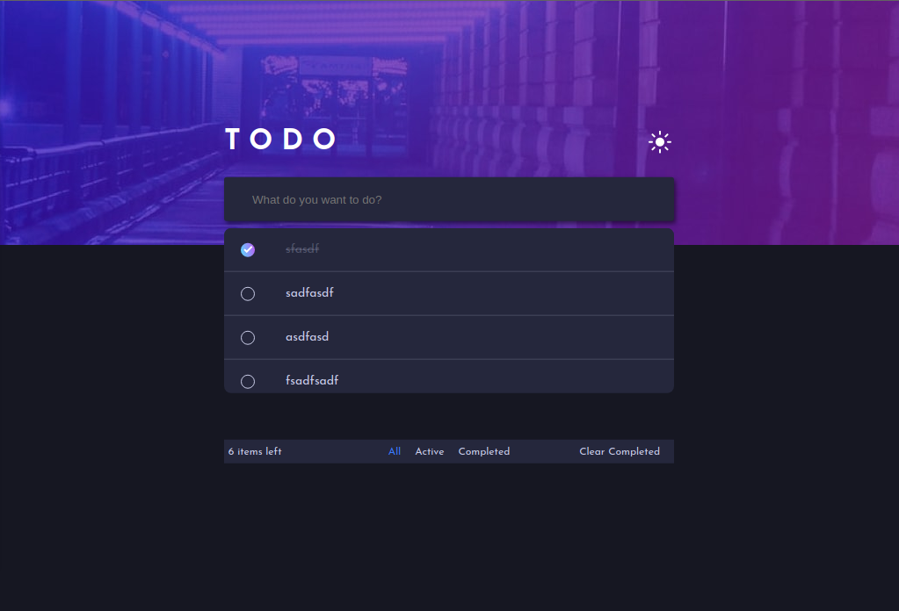

# Frontend Mentor - Todo app solution

This is a solution to the [Todo app challenge on Frontend Mentor](https://www.frontendmentor.io/challenges/todo-app-Su1_KokOW). Frontend Mentor challenges help you improve your coding skills by building realistic projects.

## Table of contents

- [Overview](#overview)
  #Todo app challenge
  - [Screenshot](#screenshot)
  - [Built with](#React js)
  - [What I learned](#what-i-learned)
- [Author](#Dev Collins)
- [Acknowledgments](#acknowledgments)

## Overview

### The challenge

Users should be able to:

- View the optimal layout for the app depending on their device's screen size
- See hover states for all interactive elements on the page
- Add new todos to the list
- Mark todos as complete
- Delete todos from the list
- Filter by all/active/complete todos
- Clear all completed todos
- Toggle light and dark mode
- **Bonus**: Drag and drop to reorder items on the list

### Screenshot

### Links

- Solution URL: (https://your-solution-url.com)
- Live Site URL: (https://devcollins-todo-app.netlify.app/)

### Built with

- [React](https://reactjs.org/) - JS library
- [Redux] - JS state management library

### What I learned

How to implement dark mode toggle and advanced ways of using state to manipulate the UI.

### Continued development

I still want to implement the drag and drop feature. I plan on achieving this in good old react then using a drag and drop library

### Useful resources

https://frontendmentor.io if you also want to improve your frontend skills

## Author

- Website - [Collins Oduor](http://iamcollinsoduor.herokuapp.com) <!--I'm working on a better site >
- Twitter - [@devCollinsKe](https://www.twitter.com/devCollinsKe)
